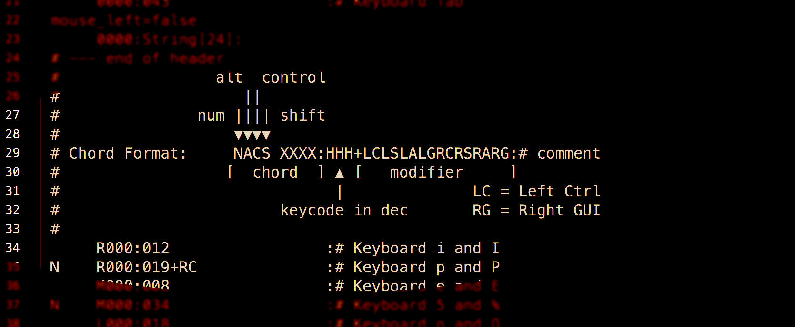

# Dido

a standalone converter for editing Twiddler [v5](http://twiddler.tekgear.com/doc/doku.php?id=twiddler_config_format) configuration files  
  
  
*a [Cool Hand](https://github.com/CoohLand/CoolHand) companion*  
  

  
```Shell
Usage:
     Extract from a Twiddler config file
     dido <twiddler.cfg>

     Generate a Twiddler config file
     dido -g <hand_crafted.txt> <twiddler.cfg>

     Extract a mirrored version
     dido -m <twiddler.cfg>

     Generate entry for string table
     dido -s "string"

e.g.  
$ ./dido twiddler.cfg > edit.txt

$ ./dido -g edited.txt twiddler2.cfg

$ ./dido -m lefthand.cfg > righthand_naive.txt

$ VAMPIRE="042 044 038+RS 039+RS" ./dido -m lefthand.cfg > righthand.txt

$ ./dido -s "50 eggs"

```

*commandline utility for macOS. Linux version in the works.*
